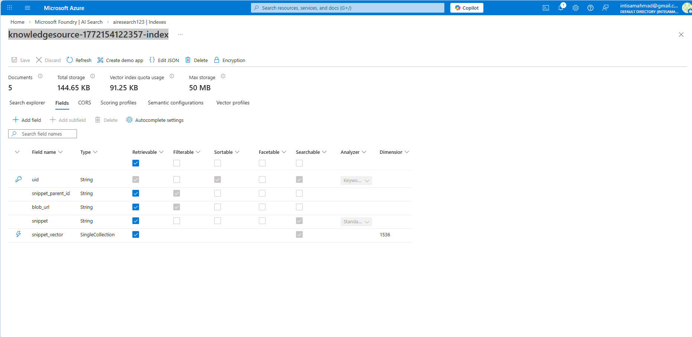

# AIRE Secure Multi-Agent Event Pipeline (with Azure RAG)

AIRE is a robust, security-first, multi-agent event processing pipeline for automated security event triage, investigation, and response. It combines strict input validation, modular agent orchestration, Retrieval-Augmented Generation (RAG) with Azure Cognitive Search, and full observability for enterprise-grade security operations.

**Final Update:**
- Only the CriticAgent sends the final, validated email notification after full review and approval.
- ResponseAgent no longer triggers email notifications.
- All agent turns, decisions, and notifications are logged for traceability.
- Email notifications are concise, structured, and sent only after CriticAgent's APPROVE.

---


- **Centralized Logging & Observability:** Every stage and agent turn is logged with minimal, relevant fields for traceability in Kibana/ELK and Prometheus.
- **Configurable & Extensible:** Easily add new rules, agents, or tools to adapt to evolving security needs.

---

## Pipeline Overview


1. **Firewall Validation**
   - `firewall/validator.py` validates event schema, sanitizes text, and detects prompt injection.
   - Unsafe or malformed events are rejected before any further processing.

2. **Detection & Risk Scoring**
   - `core/detection.py` (via `run_detection` in `core/planner.py`) loads baseline profiles and applies deterministic rules to flag suspicious events, extract findings, and assign a risk score/confidence.
   - The DetectionAgent uses this output to decide if the event should be escalated for further investigation.
   - Only events flagged as suspicious and above the risk threshold proceed to agent investigation.

3. **Retrieval-Augmented Generation (RAG) Context Injection**
   - `azure_search_utils.py` retrieves relevant policy, baseline, and knowledge context from Azure Cognitive Search using OpenAI embeddings (via `embedding_utils.py`).
   - The top RAG results are injected into the agent prompt for dynamic, explainable, and up-to-date reasoning.

4. **Multi-Agent Investigation & Response**
   - `agents/` contains modular LLM agents:
     - **DetectionAgent**: Performs event triage and risk scoring using baseline profiles from `data/baseline_profiles.json` and deterministic rules in `core/detection.py`. It outputs whether the event is suspicious, key findings, a risk score, and the baseline used for comparison.
     - **InvestigationAgent**: Deep analysis (uses RAG context)
     - **ResponseAgent**: Suggests/executes response (no email notification)
     - **CriticAgent**: Reviews and critiques actions (uses RAG context). Only CriticAgent sends the final, validated email notification after approval.
   - Each agent acts in strict order, one turn each, for efficiency and auditability.

5. **Logging & Observability**  
   - All key actions, agent turns, and decisions are logged centrally.  
   - Logs are structured for easy traceability in Kibana/ELK.  
   - Prometheus metrics track pipeline health and performance.

---

## Project Structure

**Final Note:** Only CriticAgent triggers email notifications. All agent turns and notifications are logged for traceability.

```
aire_project/
├── .env                    # Environment variables (credentials, keys)
├── app.py                  # (Optional) UI or legacy entrypoint
├── fast_api_app.py         # FastAPI event ingestion & pipeline entrypoint
├── requirements.txt        # Python dependencies
├── README.md               # Project documentation
│
├── agents/                 # Modular agent definitions
│   ├── critic_agent.py         # CriticAgent: reviews, critiques, and triggers final email notification
│   ├── detection_agent.py      # DetectionAgent: triage and risk scoring
│   ├── investigation_agent.py  # InvestigationAgent: deep analysis
│   ├── response_agent.py       # ResponseAgent: suggests response (no email)
│   └── __init__.py
│
├── core/                   # Core pipeline logic and orchestration
│   ├── detection.py            # Main detection logic: loads baselines, applies rules, calculates risk/confidence
│   ├── models.py                # Event/incident data models
│   ├── pipeline.py              # Pipeline utilities
│   ├── planner.py               # Orchestrates detection, risk scoring, and agent workflow
│   ├── response_engine.py       # (Optional) Response logic
│   ├── risk_engine.py           # Risk scoring logic
│   ├── storage.py               # Incident/event storage helpers
│   ├── team_pipeline.py         # Multi-agent investigation/response logic (email sent only after CriticAgent approval)
│   └── __init__.py
│
├── firewall/               # Input validation, sanitization, injection detection
│   ├── injection_detector.py   # Detects prompt injection attempts
│   ├── sanitizer.py            # Cleans/sanitizes text fields
│   ├── schema.py               # Event schema/structure
│   ├── validator.py            # Event validation & cleaning
│   └── __pycache__/
│
├── tools/                  # System tools (e.g., email, knowledge base)
│   ├── disable_user.py         # Example: disables user accounts
│   ├── elasticsearch_sample.py # ES tool sample
│   ├── log_action.py           # Logs actions to system
│   ├── send_email.py           # Email sending utility (used only after CriticAgent approval)
│   ├── test_send_email.py      # Email test script
│   └── __pycache__/
│
├── utility/                # Logging, LLM config, prompts
│   ├── elasticsearch_logger.py # ES logging integration
│   ├── llm_config.py           # LLM configuration
│   ├── logger.py               # Centralized logging setup
│   ├── prompts.py              # Prompt templates for agents
│   └── __init__.py
│
├── data/                   # Baseline profiles, event/incident storage
│   ├── baseline_profiles.json     # Baseline profiles for detection
│   ├── events.json              # Event storage
│   ├── incidents.json           # Incident storage
│   └── knowledge_base.json      # Knowledge base for agents
│
├── config/                 # Azure/OpenAI config files
│   ├── azure_openai_config.py
│   └── __init__.py
│
├── policies/               # Policy files
│   ├── agentic_ai_policy.txt
│   ├── cloud_security_baseline.txt
│   ├── incident_response_policy.txt
│   ├── llm_usage_policy.txt
│   ├── privileged_access_policy.txt
│
├── rag/                    # RAG utilities
│   ├── azure_search_utils.py
│   ├── create_and_upload_index.py
│   ├── embedding_utils.py
│   └── __init__.py
│
├── tests/                  # Test scripts and files
│   ├── agent_test.py
│   └── __init__.py
│
├── ui/                     # UI templates and static files
│   ├── static/
│   └── templates/
│
├── event.json              # Sample event file
├── __archive/              # Archive/legacy files
├── __pycache__/            # Python cache
└── .venv/                  # Python virtual environment
```

---

## How to Run

**Final Note:** Email notifications are sent only after CriticAgent approval. ResponseAgent does not trigger emails.

1. **Clone the repository**

2. **Install dependencies**
   ```sh
   pip install -r requirements.txt
   ```

3. **Configure Azure OpenAI and Azure Cognitive Search**
   - Edit `azure_openai_config.py` with your Azure OpenAI and Azure Cognitive Search credentials, endpoint, and index name.
   - Ensure your Azure Search index has a vector field (e.g., `snippet_vector`) and is populated with documents and embeddings.

4. **(Optional) Create and upload the Azure Search index**
   ```sh
   python create_and_upload_index.py
   ```

5. **Start the FastAPI server**
   ```sh
   uvicorn fast_api_app:app --reload
   ```

6. **Send events to the pipeline**
   - POST to `http://localhost:8000/ingest` with your event JSON.

---

## Security Workflow (What Happens to Each Event)

**Final Note:**
- Email notifications are concise, structured, and sent only after CriticAgent's APPROVE.
- All logs and notifications are traceable in Kibana/ELK.

1. **Firewall Validation**:  
   - Event is checked for schema, sanitized, and scanned for prompt injection.  
   - If validation fails, the event is rejected (400 error).
2. **Detection & Risk Scoring**:  
   - `core/detection.py` (via `run_detection`) flags suspicious events, extracts findings, assigns a risk score/confidence, and returns the baseline profile used.
   - The DetectionAgent uses this output to determine if the event should be escalated for investigation.
3. **RAG Context Retrieval**:  
   - For suspicious events, the pipeline queries Azure Cognitive Search using the event as a query, retrieves the most relevant policy, baseline, and knowledge context using OpenAI embeddings, and injects this into the agent prompt.
4. **Multi-Agent Investigation**:  
   - InvestigationAgent, ResponseAgent, and CriticAgent each take one turn, referencing the RAG context and baseline in their reasoning and critique.
5. **Logging & Metrics**:  
   - Every stage and agent turn is logged for traceability in Kibana/ELK.  
   - Prometheus metrics track pipeline health.
6. **Response**:  
   - Automated or manual response is triggered as needed.

---

## Customization & Extensibility

**Final Note:**
- To change notification logic, update CriticAgent's prompt and team_pipeline.py.

- **Add new detection rules** in `core/detection.py` or `risk_engine.py`.
- **Add/modify agents** in `agents/` for new investigation or response logic.
- **Tune firewall validation** in `firewall/validator.py`, `schema.py`, or `sanitizer.py`.
- **Integrate with more tools** via the `tools/` directory.
- **Change RAG retrieval logic** in `azure_search_utils.py` to adjust how context is retrieved or formatted for agents.
- **Update embedding logic** in `embedding_utils.py` to use different models or providers if needed.

---

## Screenshots & Visualizations

### 1. Kibana Integration


### 2. Prometheus Metrics


### 3. SOAR HTML UI


### 4. Complete Pipeline


### 5. Retrieval-Augmented Generation (RAG)


---

## License

**Final Note:**
- Developed by Intisam Ahmed. All rights reserved.

Apache License 2.0

---

**Developed by Intisam Ahmed**

All rights reserved.
