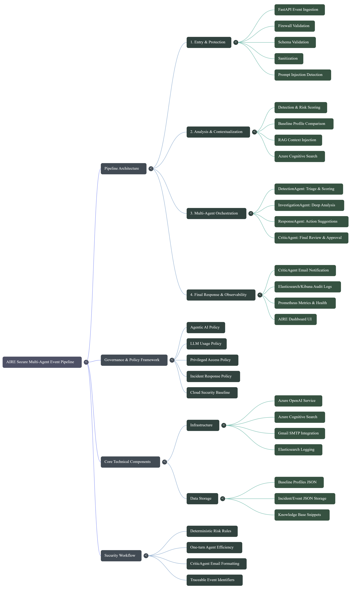
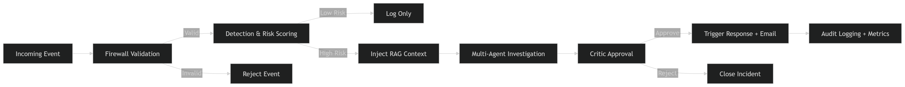
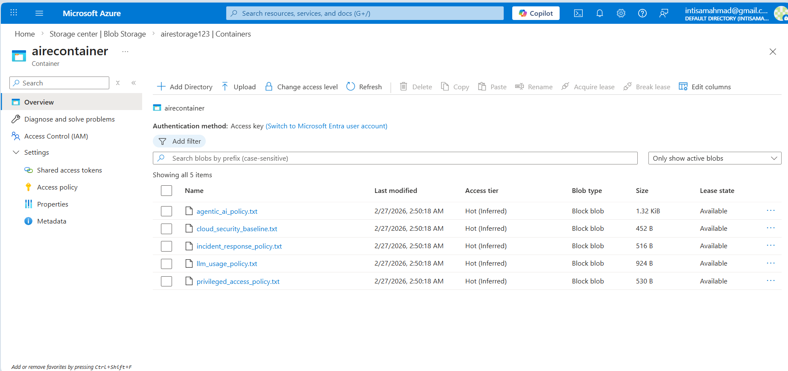
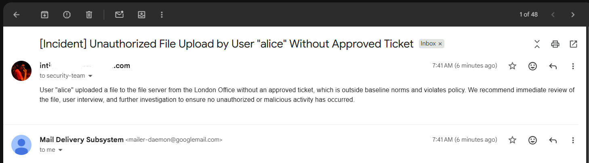

# AIRE: AI-Driven SOAR Pipeline

<div align="center">
  
  
  
  
  
  
  
</div>

---


**Enterprise-Grade, Modular, Multi-Agent SOAR for AI-Driven Security Automation**

---


## 🚀 Overview


AIRE (AI-Driven Incident Response Engine) is a next-generation, modular SOAR pipeline built for enterprise security automation. Powered by Python, FastAPI, Azure OpenAI, and advanced agent frameworks, AIRE orchestrates intelligent, scalable, and secure incident response workflows.

---


## 📄 Full Documentation & Visuals

- **Detailed Pipeline PDF:**  
  [AIRE_Pipeline.pdf](images/AIRE_Pipeline.pdf) – Download the full pipeline and flow documentation as a PDF for offline reference and deep technical details.

- **Mind Map Overview:**  
  
  *AIRE Secure Multi-Agent Event Pipeline mind map: Shows the architecture, governance, technical components, and security workflow at a glance.*

- **Event Processing Pipeline:**  
  
  *Step-by-step event processing flow: From incoming event validation, risk scoring, RAG context injection, multi-agent investigation, to final approval and audit logging.*

---

## 🖼️ Visual Overview

### AIRE Security Event Pipeline


---


## 🌟 Key Features

- **Multi-Agent Architecture**: Modular agents for classification, knowledge base, notifications, and more
- **RAG-Enabled**: Retrieval-Augmented Generation for contextual, accurate responses
- **Prometheus Monitoring**: Real-time metrics and health checks
- **Elasticsearch & Kibana**: Advanced search and visualization
- **Azure AI Search**: Enterprise-grade search capabilities
- **Secure & Open Source**: Designed for extensibility and security

---


## 🏗️ Architecture & Workflow


#### How to add Architecture.PNG to GitHub
1. Place your Architecture.PNG file in the `images/` directory of your project.
2. Stage and commit the image:
   ```bash
   git add images/Architecture.PNG
   git commit -m "Add architecture diagram"
   git push origin main
   ```
3. Reference it in your README as shown above.

---


## 🔥 End-to-End Pipeline Flow


### 1️⃣ Firewall Validation
🔒 All incoming events are validated for schema, sanitized, and checked for prompt injection using `firewall/validator.py`, `schema.py`, and `injection_detector.py`. Unsafe or malformed events are rejected before entering the pipeline.

### 2️⃣ Detection & Risk Scoring
🕵️‍♂️ The DetectionAgent leverages baseline profiles and deterministic rules from `core/detection.py` to flag suspicious events. It compares event data against `data/baseline_profiles.json` (location, roles, hours) to calculate risk scores. Only events above the risk threshold proceed.


### 3️⃣ Retrieval-Augmented Generation (RAG) Context Injection
📚 For flagged events, relevant policy, baseline, and knowledge context are retrieved from Azure Cognitive Search using OpenAI embeddings (`rag/azure_search_utils.py`, `rag/embedding_utils.py`). It retrieves relevant context from `Azure Cognitive Search`, including `Agentic AI` and `LLM Usage Policies`, to ensure agent responses remain compliant with organizational guardrails..


#### Azure Storage Blob 


#### Azure Storage RAG 


### 4️⃣ Multi-Agent Investigation & Response
🤖 AIRE utilizes the `AutoGen (AG2) framework` to orchestrate a high-precision, sequential multi-agent workflow. Rather than isolated tasks, the agents operate as a `unified Security Operations Team`, where the output of one agent serves as the immediate, enriched context for the next:
- **`DetectionAgent`**: Performs initial triage and risk scoring by comparing events against `baseline_profiles.json`.
- **`InvestigationAgent`**: Conducts deep-dive analysis using `RAG context` (Company Policies) retrieved from `Azure AI Search`.
- **`ResponseAgent`**: Suggests and executes the most secure mitigation strategy based on investigative findings.
- **`CriticAgent`**: Acts as the `final auditor`. Reviews all previous actions and is the **only** agent authorized to trigger external email notifications, strictly after an `APPROVE` verdict.

`Each agent turn, decision, and notification is logged` for 100% traceability within Kibana/ELK.


#### SOAR HTML UI 


### 5️⃣ Logging & Observability
📊 All key actions, agent turns, and decisions are logged centrally (`utility/logger.py`, `utility/elasticsearch_logger.py`). Logs are structured for easy traceability in Kibana/ELK. Prometheus metrics track pipeline health and performance.


#### Kibana Integration 


### 6️⃣ Response & Notification
📧 Automated or manual response is triggered as needed. Only CriticAgent sends the final, validated email notification after full review and approval.


#### Email Notification 


#### Prometheus Metrics 


---

## ⚡ Quick Start

```bash
# 1. Clone the repo
git clone https://github.com/yourusername/aire_project.git

# 2. Install dependencies
pip install -r requirements.txt

# 3. Configure Azure OpenAI & Cognitive Search
#    Edit azure_openai_config.py with your credentials

# 4. (Optional) Create & upload Azure Search index
python create_and_upload_index.py

# 5. Start the FastAPI server
uvicorn fast_api_app:app --reload

# 6. Send events to the pipeline
#    POST to http://localhost:8000/ingest with your event JSON
```

---

## 📁 Directory Structure

```bash
aire_project/
├── .env                    # Environment variables (credentials, keys)
├── app.py                  # (Optional) UI or legacy entrypoint
├── fast_api_app.py         # FastAPI event ingestion & pipeline entrypoint
├── requirements.txt        # Python dependencies
├── README.md               # Project documentation
│
├── agents/                 # Modular agent definitions
│   ├── critic_agent.py         # CriticAgent: reviews, critiques, and triggers final email notification
│   ├── detection_agent.py      # DetectionAgent: triage and risk scoring
│   ├── investigation_agent.py  # InvestigationAgent: deep analysis
│   ├── response_agent.py       # ResponseAgent: suggests response (no email)
│   └── __init__.py
│
├── core/                   # Core pipeline logic and orchestration
│   ├── detection.py            # Main detection logic: loads baselines, applies rules, calculates risk/confidence
│   ├── models.py                # Event/incident data models
│   ├── pipeline.py              # Pipeline utilities
│   ├── planner.py               # Orchestrates detection, risk scoring, and agent workflow
│   ├── response_engine.py       # (Optional) Response logic
│   ├── risk_engine.py           # Risk scoring logic
│   ├── storage.py               # Incident/event storage helpers
│   ├── team_pipeline.py         # Multi-agent investigation/response logic (email sent only after CriticAgent approval)
│   └── __init__.py
│
├── firewall/               # Input validation, sanitization, injection detection
│   ├── injection_detector.py   # Detects prompt injection attempts
│   ├── sanitizer.py            # Cleans/sanitizes text fields
│   ├── schema.py               # Event schema/structure
│   ├── validator.py            # Event validation & cleaning
│   └── __pycache__/
│
├── tools/                  # System tools (e.g., email, knowledge base)
│   ├── disable_user.py         # Example: disables user accounts
│   ├── elasticsearch_sample.py # ES tool sample
│   ├── log_action.py           # Logs actions to system
│   ├── send_email.py           # Email sending utility (used only after CriticAgent approval)
│   ├── test_send_email.py      # Email test script
│   └── __pycache__/
│
├── utility/                # Logging, LLM config, prompts
│   ├── elasticsearch_logger.py # ES logging integration
│   ├── llm_config.py           # LLM configuration
│   ├── logger.py               # Centralized logging setup
│   ├── prompts.py              # Prompt templates for agents
│   └── __init__.py
│
├── data/                   # Baseline profiles, event/incident storage
│   ├── baseline_profiles.json     # Baseline profiles for detection
│   ├── events.json              # Event storage
│   ├── incidents.json           # Incident storage
│   └── knowledge_base.json      # Knowledge base for agents
│
├── config/                 # Azure/OpenAI config files
│   ├── azure_openai_config.py
│   └── __init__.py
│
├── policies/               # Policy files
│   ├── agentic_ai_policy.txt
│   ├── cloud_security_baseline.txt
│   ├── incident_response_policy.txt
│   ├── llm_usage_policy.txt
│   ├── privileged_access_policy.txt
│
├── rag/                    # RAG utilities
│   ├── azure_search_utils.py
│   ├── create_and_upload_index.py
│   ├── embedding_utils.py
│   └── __init__.py
│
├── tests/                  # Test scripts and files
│   ├── agent_test.py
│   └── __init__.py
│
├── ui/                     # UI templates and static files
│   ├── static/
│   └── templates/
│
├── event.json              # Sample event file
├── __archive/              # Archive/legacy files
├── __pycache__/            # Python cache
└── .venv/                  # Python virtual environment
```

---

## 🛡️ Security & Observability

- **Centralized Logging**: Every stage and agent turn is logged with minimal, relevant fields for traceability in Kibana/ELK and Prometheus.
- **Configurable & Extensible**: Easily add new rules, agents, or tools to adapt to evolving security needs.
- **Prometheus Metrics**: Track pipeline health and performance in real time.

---

## 🛠️ Customization & Extensibility

- Add new detection rules in `core/detection.py` or `risk_engine.py`
- Add/modify agents in `agents/` for new logic
- Tune firewall validation in `firewall/validator.py`, `schema.py`, or `sanitizer.py`
- Integrate more tools via `tools/`
- Change RAG retrieval logic in `azure_search_utils.py`
- Update embedding logic in `embedding_utils.py`

---

## 🤝 Contributing

We welcome contributions! Fork the repo, submit pull requests, and help us build the future of AI-driven security automation.

---

## 📜 License

Apache License 2.0

---

**Developed by Intisam Ahmed**
All rights reserved.
